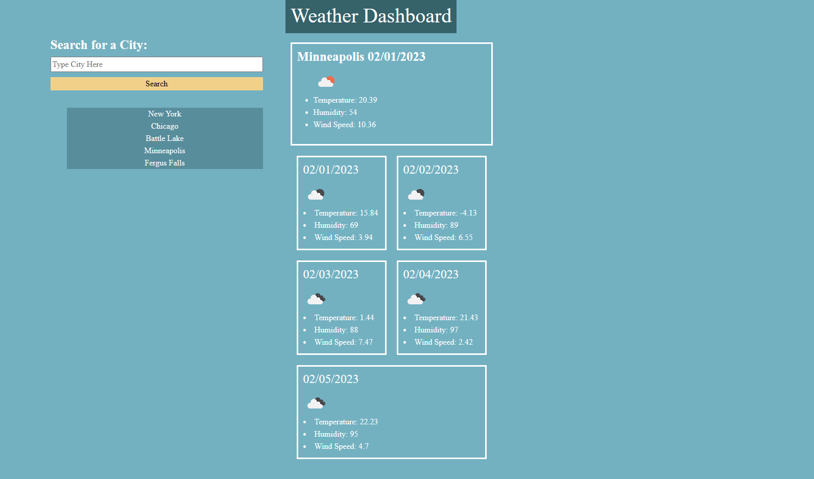

# weather-dashboard-id

## Description

This application uses a weather api to allow users to input a city of their choosing, once selected the application provides the user with a 5-day weather forcast. The application also saves the users recent searches using local storage.

## Usage

All the user needs to do is follow the link provided here: https://isaackice.github.io/weather-dashboard-id/, this application is available on any device and browser.

## Credits

Rutgers Bootcamp, W3 Schools, Professor Joe Han, TA Paul Cwik, Classmates Jake Nguyen, Eric Kirberger and Azime Nail.

## License

MIT License ,, Please refer to the GitHub repo